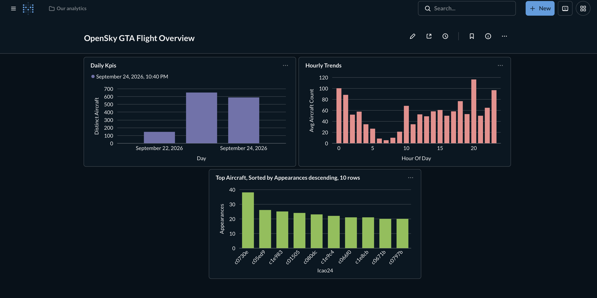

# OpenSky Flight Pipeline — Bronze/Silver/Gold on Postgres + Airflow

An end-to-end data pipeline that polls live aircraft data over the
Greater Toronto Area from the [OpenSky Network](https://opensky-network.org/apidoc/rest.html)
API, lands it raw, cleans it, and aggregates it into business-ready
tables for dashboarding.

## Architecture

OpenSky API ---> Bronze (raw JSONB) ---> Silver (typed, deduped) ---> Gold (KPIs)
| | |
bronze.raw_states silver.state_vectors gold.daily_kpis
silver.dq_log gold.hourly_trends
gold.top_aircraft

Orchestrated by Airflow on a 10-minute schedule:

ingest_bronze >> transform_silver >> quality_checks >> build_gold

## Why this design

- **Bronze stores the untouched API response** as JSONB. If OpenSky
  changes its schema or a bug corrupts Silver, the raw data can always
  be replayed.
- **Silver is idempotent.** Natural key `(icao24, last_contact)` with
  `ON CONFLICT DO UPDATE` means re-running a batch never creates
  duplicates — verified by re-processing overlapping snapshots during
  development and confirming row counts matched expectations.
- **Gold reads only from Silver**, never Bronze, keeping lineage simple.
- **Quality checks run as their own Airflow task**, between Silver and
  Gold, so a bad batch is caught before it reaches the dashboard layer.

## Setup

1. Register a free [OpenSky Network](https://opensky-network.org) account
   and generate API client credentials (Account → API Client).
2. Copy `.env.example` to `.env` and fill in your `OPENSKY_CLIENT_ID`
   and `OPENSKY_CLIENT_SECRET`, plus adjust `WAREHOUSE_PORT` if `5432`
   is already in use on your machine.
3. Start everything:
   docker compose up -d
4. Open the Airflow UI at http://localhost:8080 (default login:
   `admin` / `admin`), unpause `opensky_flight_pipeline`, and trigger
   a run.

## Running a single step manually (useful for debugging)
python scripts/ingest_bronze.py
python scripts/transform_silver.py
python scripts/quality_checks.py
python scripts/build_gold.py

## Connecting a BI tool (Metabase)

Power BI Desktop has no native macOS version, so this project uses
[Metabase](https://www.metabase.com/) instead — a free, open-source BI
tool that runs as just another Docker container, requiring no
platform-specific drivers.

Metabase is defined as a service in `docker-compose.yml` and starts
alongside the rest of the stack:

docker compose up -d metabase

Then open http://localhost:3000, complete the first-run setup, and
add a database with:
- Host: `postgres` (the container's internal Docker network name —
  not `localhost`, since Metabase runs inside the same Docker network
  as Postgres)
- Port: `5432` (Postgres's internal port, not the `5433` external
  port used when connecting from outside Docker)
- Database: `flights`
- Schemas: `gold` only — the layer meant for consumption
- Username / Password: as set in `.env`

### Dashboard

Three questions were built directly on the Gold tables (no
aggregation needed in Metabase — Gold is already pre-aggregated):
- **Daily Kpis** — aircraft count and traffic volume per day
- **Top Aircraft** — top 10 most-frequently-tracked aircraft, sorted
  and limited in the query builder
- **Hourly Trends** — average aircraft count by hour of day

These are combined into a single dashboard, "OpenSky GTA Flight
Overview." The Daily Kpis and Hourly Trends charts show a single bar
initially and become genuinely useful trend lines after the pipeline
has run across multiple days/hours.

## Tech decisions

| Decision | Why |
|---|---|
| Postgres for all 3 layers | Simpler to run locally; JSONB gives Bronze schema flexibility without a separate document store |
| Airflow LocalExecutor | No need for distributed workers at this scale |
| Upsert-based Silver | Makes reruns/backfills safe |
| Bounding box scoping (GTA) | Keeps data volume manageable and dashboard-relevant |
| OAuth2 client-credentials auth | OpenSky retired basic-auth login in March 2026; script exchanges `client_id`/`client_secret` for a short-lived bearer token on each run |